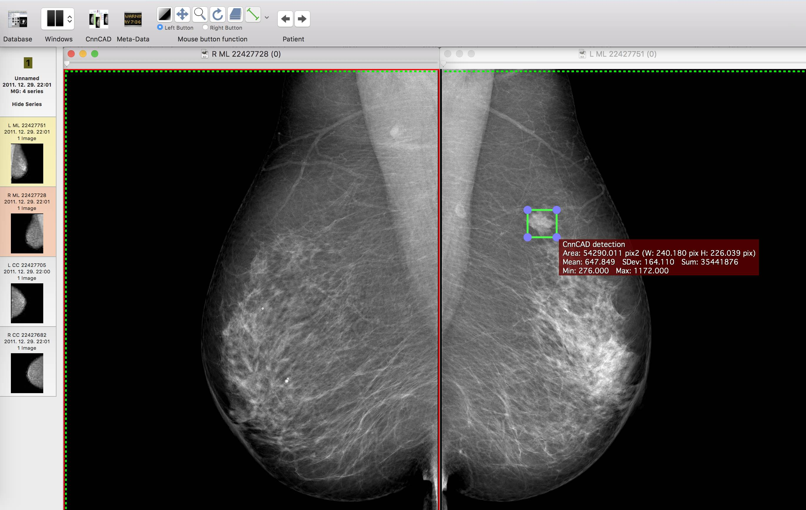

# Computer aided detection with Faster-RCNN

A VGG16 based Faster-RCNN detector trained to detect breast cancer lesions on mammogram images.

For more details and results please see the article on arXiv: https://arxiv.org/abs/1707.08401

---

### Model weights

Model weights can de downloaded from here:
- http://dkrib.web.elte.hu/cad_faster_rcnn/vgg16_frcnn_cad.caffemodel

---

### OsiriX/Horos plugin

I wrote a plugin for the popular medical image viewer: OsiriX/Horos. This is a simplified version of the model. It is based on [CoreML](https://developer.apple.com/machine-learning/). In order to run it you will need:
- A mac
- High Sierra (10.13) operating system ( becase of CoreML )
- [Horos](https://www.horosproject.org) (free) or OsiriX medical image viewer.

Installation: Download the plugin, unzip it, click on the installer, and approve it. Restart OsiriX/Horos. The plugin will appear in the menu of OsiriX/Horos: Plugins/Image Filters/CnnCAD. You can also add it to the toolbar of the 2D viewer.

Usage: Open the images in the 2D viewer and click on the menu item: Plugins/Image Filters/CnnCAD. A pop-up will appear to remind you that the tool is not for medical use, and to warn you that detection may take minutes depending on your computer. Just click OK, wait until the beachball stops spinning and the ROI markers appear on the image (In case the model found something, I recommend to run the first test with an obvious cancer).

Note: The plugin is only tested with Horos. OsiriX MD may not work correctly at this time.

Note: The plugin does not work correctly with OsiriX Lite! OsiriX Lite exposes only a downsampled image of the mammogram, and as a result the marks are radically shifted towards the upper left corner. I do not wish to solve this issue with OsiriX Lite, firstly because mammograms should be viewed at full resolution, and also because the program is unusable anyway due to extremely annoying popups.

The OsiriX/Horos plugin can be downloaded from here:
- DISCLAIMER: NOT FOR MEDICAL USE!!! THE PLUGIN IS FOR DEMONSTRATION/RESEARCH/EDUCATION PURPUSES ONLY!
- http://dkrib.web.elte.hu/cad_faster_rcnn/CnnCAD.osirixplugin.zip

---

If you want to use the model or the plugin in your research please cite:
> Ribli, Dezső, et al. "Detecting and classifying lesions in mammograms with Deep Learning." arXiv preprint arXiv:1707.08401 (2017).
